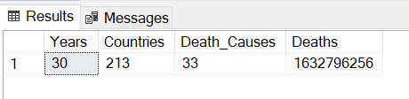
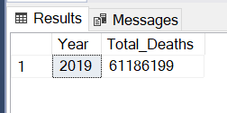
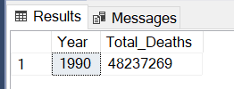
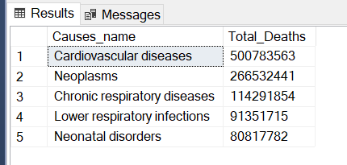
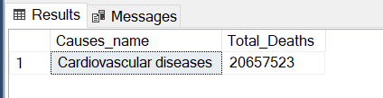
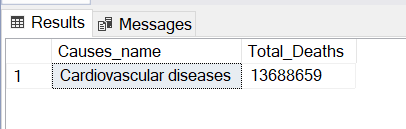
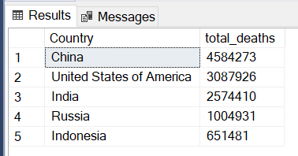
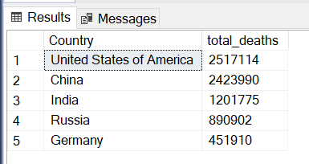

# Causes-of-Death

This analysis investigates patterns in causes of death across multiple countries over three decades. The dataset contains information solely on death causes, death numbers, countries, and respective years.

### Renaming a column

EXEC sp.rename 'Causes Of Death.Entity', 'Country', 'COLUMN'

### Replacing values
UPDATE [Causes Of Death]
SET Country = 
    CASE 
        WHEN Country = 'United States' THEN 'United States of America'
        ELSE Country
    END
WHERE Country = 'United States';

UPDATE [Causes Of Death]
SET Country = 
    CASE 
        WHEN Country = 'America' THEN 'United States of America'
        ELSE Country
    END
WHERE Country = 'America';

### KPIs

### Year with the highest number of deaths

### Year with the least number of deaths

### Leading Causes of Death

### Leading death cause in 2019

### Leading death cause in 1990

### Top 5 countries affected by Cardiovascular diseases in 2019

### Top 5 countries affected by Cardiovascular diseases in 1990

